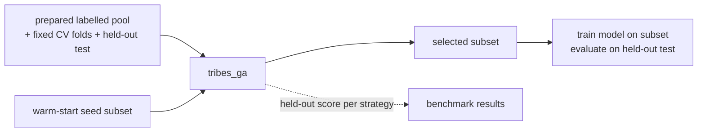
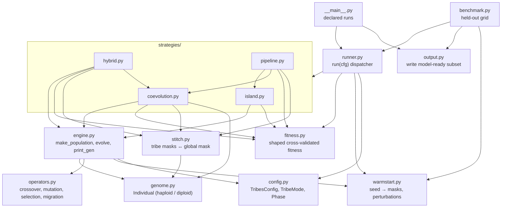
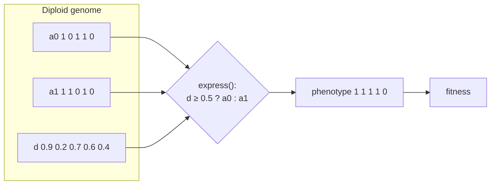
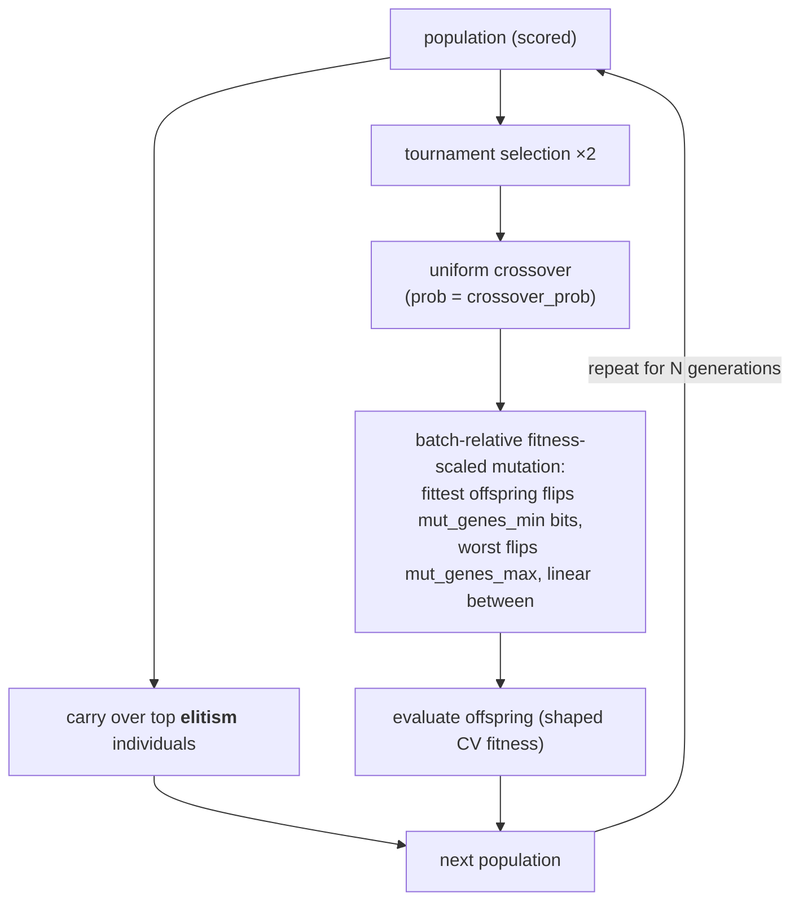
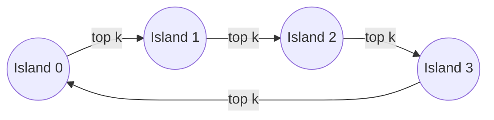
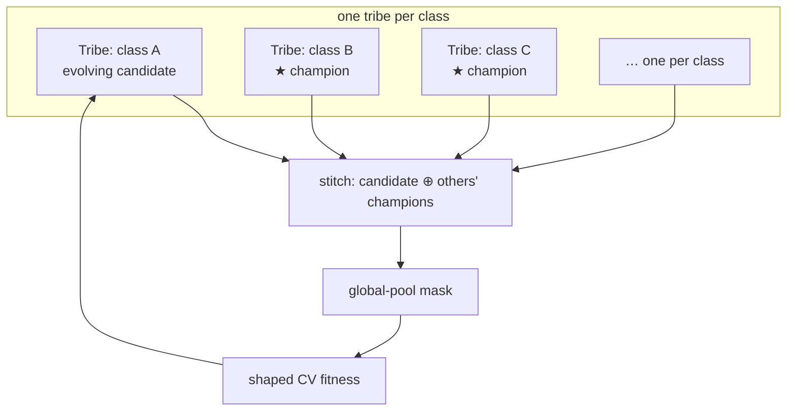

# tribes_ga

> **Status (Sep 2026): library only.** The standalone runner (`python -m tribes_ga`), the
> `benchmark`, `output`, and the island / hybrid / pipeline strategies were removed once the
> CNN-in-the-loop driver **`run_saga.py`** (repo root) became the single production path.
> SAGA uses the modules that remain: `config`, `genome` (diploid), `operators`, `engine`
> (per-class populations, i.e. the coevolution tribe), `fitness` (shaped no-regression CV
> fitness), `stitch`, and `warmstart`. Sections below describing the four strategies and the
> `Usage` commands are kept as design history; see the top-level README for how to run SAGA.

A configurable **genetic algorithm for training-subset selection**. Given a large,
noisy, class-imbalanced pool of labelled examples, `tribes_ga` searches for the
*subset* that — when a model is trained on it — maximises held-out accuracy **without
regressing any single class's recall**.

The core is dataset- and model-agnostic: it plugs into a host pipeline that supplies a
prepared example pool, fixed cross-validation folds, and a per-fold trainer. The one
concrete binding to this repository is isolated in [Integration](#integration).

---

## Why subset selection

More training data is not automatically better. Mislabelled, duplicated, or
off-distribution examples drag a class down, and minority classes are easily drowned
out. Choosing *which* examples to train on reframes the problem as a search over one bit
per sample (keep / drop) — a space far too large to enumerate and riddled with local
optima, which is exactly the regime genetic algorithms are built for.

The distinguishing requirement is the **no-regression constraint**: a subset that lifts
overall accuracy by sacrificing one class is unacceptable. That constraint is encoded
directly into the fitness function, and the *tribe* strategies below exist to satisfy it
structurally.

The name reflects the design: the package combines two paradigms from evolutionary
computation — the **island model** (several full-pool populations that evolve in
parallel and exchange migrants) and **cooperative coevolution** (one population per
class, each evolving a piece of the solution that is then combined). A *tribe* is the
umbrella term for either kind of semi-independent sub-population.



---

## Package layout

Each module owns one responsibility. The dependency graph is a DAG: the strategies
compose the engine and the stitch bridge; the runner composes the strategies.



| Module | Responsibility |
|---|---|
| `config.py` | Every knob for a run in one `TribesConfig` dataclass; the `TribeMode` and `Phase` enums. |
| `genome.py` | The `Individual` — a variable-size binary in/out mask, haploid or diploid. |
| `operators.py` | GA operators over masks: uniform crossover, fitness-scaled mutation, tournament selection, elitism, ring migration. |
| `warmstart.py` | Turns the seed into masks and near-seed perturbations; exposes pool geometry. |
| `fitness.py` | The shaped, cross-validated objective (see below). Owns its own baseline so it is tunable in isolation. |
| `engine.py` | The **generic GA engine**: initialise one population, advance it one generation. Strategy-agnostic. |
| `stitch.py` | The **coevolution bridge**: assemble per-class tribe masks into one global-pool mask. |
| `strategies/` | The four tribe strategies — one file each. |
| `runner.py` | `run(cfg)`: prepare pool geometry + fitness baseline, dispatch to the chosen strategy. |
| `output.py` | Write the selected subset to a model-ready form. |
| `__main__.py` | Declarative list of runs (`python -m tribes_ga`). |
| `benchmark.py` | Compare strategies on the held-out test set, averaged over seeds. |

---

## The genome

A genome is a **binary mask** — one bit per pool sample, `1` = keep, `0` = drop — of
variable selected size. Two representations are supported per individual.

**Haploid** (default): a single mask; the phenotype (what fitness sees) *is* the mask.

**Diploid** (opt-in, `diploid=True`): two allele masks `a0`, `a1` plus a continuous
per-gene dominance `d ∈ [0,1]`. The expressed bit is `a0` where `d ≥ 0.5`, else `a1`. The
hidden allele is **latent diversity**: a "silent" mutation flips it without changing the
phenotype, so the population can cheaply revert a gene later instead of rediscovering it —
a hedge against noise and sharp fitness spikes. A warm-started diploid begins with
`a0 = a1 = seed` and `d = 1.0`, expressing the seed exactly, then diversifies.



---

## The evolutionary engine

`engine.py` advances **one** population by one generation. It knows nothing about tribes;
every strategy calls it.



Scaling the number of bit-flips to each offspring's rank *within its batch* is an
anti-collapse mechanism: the best candidates fine-tune while the weakest explore, so a
warm-started population climbs past its seed instead of collapsing back onto it.

---

## The four strategies

### `island` — parallel populations + migration
N independent full-pool populations evolve in parallel; every `migration_interval`
generations the top individuals of each island are copied into the next around a ring.
Diversity across islands is what escapes local optima.



### `class_coevolution` — one tribe per class
Each class gets its own tribe, evolving only that class's samples. To score a candidate,
it is **stitched** into a full mask alongside every *other* tribe's current champion, then
run through the shared fitness. Tribes co-adapt toward a globally strong subset — and
because each tribe optimises with its own class always represented, this is the strategy
that most directly serves the no-regression objective. (Unlike islands, tribes do **not**
migrate individuals: each tribe's genome spans a different class's samples, so a migrant
would be meaningless in another tribe. Co-adaptation happens through stitching instead.)



### `hybrid` — coevolve, then merge
Run `class_coevolution` for the first `merge_at` fraction of the budget, then stitch the
tribe populations into full masks and finish as a single global island. Front-loads
per-class co-adaptation, then polishes globally.

### `pipeline` — arbitrary phase chains
Run any sequence of primitives, each phase warm-started from the previous phase's best
mask. Phases are `I` (island) and `C` (coevolution), so `C→I` reproduces the hybrid and
`I→C→I` chains every idea — assembled with no new code.


---

## The objective: shaped cross-validated fitness

A subset is scored by training on its samples and validating over the host pipeline's
fixed CV folds. Per fold:

```
fold_score = overall_accuracy
           + reward_weight  · mean_c(recall_c)
           − penalty_weight · Σ_c max(0, (baseline_recall_c − floor_tolerance) − recall_c)
```

- **accuracy** is the primary signal.
- the **reward** term gives an uphill gradient on mean per-class recall, so the search
  always has somewhere to climb.
- the **penalty** term is the no-regression floor: for every class whose recall falls more
  than `floor_tolerance` below the *baseline* (measured once from the seed at the start of a
  run), subtract the shortfall scaled by `penalty_weight`. The tolerance widens the seed
  from a sharp spike into a navigable plateau — without it, warm-started search collapses
  straight back onto the seed.

Fitness is the mean fold score.

---

## Usage

> **Historical.** The commands in this section no longer exist; run `run_saga.py` from the
> repo root instead (see the top-level README, "Training-Set Curation").

Run from the repository root (so the top-level packages resolve on `sys.path`).

### Produce a subset
Edit the `EXPERIMENTS` list in [`__main__.py`](__main__.py) — each entry is a full
`TribesConfig`, override only the fields you want — then:

```bash
python -m tribes_ga
```

Each run writes its selected subset to a model-ready JSON file (see `output.py`).

### Benchmark strategies on held-out accuracy
```bash
python -m tribes_ga.benchmark
```

Runs a grid of phase pipelines × {haploid, diploid} over several random seeds. For each
run it trains a model on the selected subset and scores it on the **held-out test set** — a
real generalisation number, not the shaped fitness the GA optimises — then reports, per
combination, the mean ± std of test accuracy, macro-recall, and min-class-recall versus
the seed baseline.

### From code
```python
from tribes_ga import run, TribesConfig, TribeMode
from tribes_ga.config import Phase

mask, fitness = run(TribesConfig(
    mode=TribeMode.PIPELINE,
    pipeline=(Phase.ISLAND, Phase.COEV, Phase.ISLAND),
    generations=40,
))
# `mask` is a global-pool binary mask; feed it to tribes_ga.output.write_subset.
```

---

## Configuration reference (`TribesConfig`)

| Field | Default | Meaning |
|---|---|---|
| `mode` | `ISLAND` | `ISLAND`, `CLASS_COEVOLUTION`, `HYBRID`, or `PIPELINE`. |
| `pipeline` | `None` | For `PIPELINE`: the phase sequence, e.g. `(Phase.ISLAND, Phase.COEV, Phase.ISLAND)`. |
| `diploid` | `False` | Opt-in adaptive-dominance diploid genome. |
| `stochastic_dominance` | `False` | Express `a0` with probability `d` instead of a 0.5 threshold. |
| `num_tribes` | `4` | Island count (ISLAND/HYBRID). Coevolution uses one tribe per class. |
| `pop_per_tribe` | `60` | Individuals per population. |
| `generations` | `60` | Total generations (split across phases in PIPELINE). |
| `migration_interval` | `5` | ISLAND: migrate every N generations (`0` disables migration). |
| `migration_rate` | `0.1` | ISLAND: fraction of each island migrated per event (at least 1 individual when active; `0.0` disables). |
| `merge_at` | `0.5` | HYBRID: fraction of generations before merging to a global island. |
| `crossover_prob` | `0.7` | Uniform-crossover probability. |
| `tournament_k` | `3` | Tournament size. |
| `elitism` | `3` | Individuals carried over unchanged. |
| `mut_genes_min` / `mut_genes_max` | `5` / `400` | Bit-flip range for batch-relative mutation. |
| `floor_tolerance` | `0.03` | Allowed per-class recall dip below baseline before penalising. |
| `reward_weight` | `0.25` | Weight on mean per-class recall. |
| `penalty_weight` | `2.0` | Weight on the no-regression shortfall. |
| `n_folds` | `5` | CV folds used for fitness (fewer = faster, noisier). |
| `warm_start` | `True` | Seed the initial population near the seed subset. |
| `perturb_min` / `perturb_max` | `0.02` / `0.20` | Per-individual init perturbation range. |
| `seed` | `42` | RNG seed. |

---

## Integration

`tribes_ga` needs three things from a host pipeline: a prepared example pool
(`X_pool`, `pool_labels`), a set of fixed CV folds plus a held-out test set, and a
per-fold trainer that fits a model on selected indices and predicts a fold. In this
repository those come from [`classification/DataCreator.py`](../classification/DataCreator.py),
wired up in `fitness.py` and `warmstart.py`.

The binding is deliberately one-way and read-only:

- it **imports** the prepared pool, folds, test set, and trainer, so `tribes_ga` and the
  host optimise an identical problem on identical data;
- it **reimplements the scoring locally** (in `fitness.py`) so a run owns its own baseline,
  tolerance, and weights and can be tuned without touching the host;
- it **writes only its own subset outputs** and never modifies the host's files.

To retarget `tribes_ga` at a different pipeline, repoint `warmstart.py` (pool geometry +
seed) and `fitness.py` (folds + trainer) at the new source; the engine, strategies, and
genome are unchanged.
